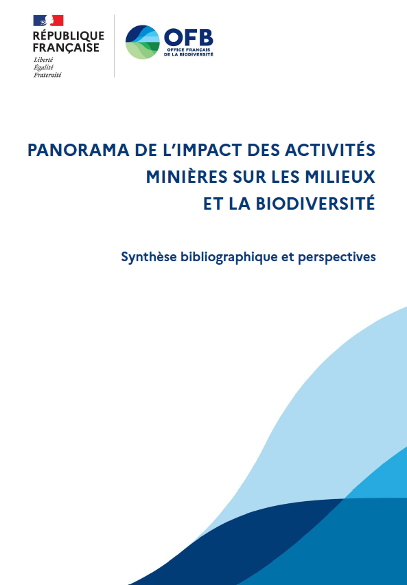

# Auteurs
**GABRIEL MELUN** (Direction de la recherche et de l’appui scientifique - DRAS)
gabriel.melun@ofb.gouv.fr (01.45.14.88.83)

**PIERRE BOYER** (Direction de la Police et du permis de chasser - DPPC)
pierre.boyer@ofb.gouv.fr (01.45.14.88.93)

# Résumé
Les mines s’intéressent à l’extraction de substances minérales / stratégiques 0, notamment les
métaux (or, argent, cuivre, nickel, uranium, etc.), les métalloïdes (arsenic, antimoine, silicium,
etc.) et les combustibles fossiles (pétrole, gaz naturel, houille, lignite, etc.). L’extraction de ces
substances d’intérêt est aujourd’hui massive, afin notamment de répondre à la demande
croissante accompagnant la transition énergétique, numérique et la décarbonation. Les travaux
miniers sont conduits majoritairement en surface mais de nombreuses exploitations sont
encore menées en souterrain, alors même que les ressources sous-marines suscitent désormais
un fort engouement. Ce rapport a pour premier objectif de réaliser une synthèse
bibliographique, scientifique et objective, des impacts environnementaux induits par les
activités minières à l’échelle nationale et internationale. Il présente ainsi successivement les
impacts liés 1) à la déforestation, 2) aux altérations géomorphologiques et
hydromorphologiques, 3) à la dégradation - qualitative et quantitative - de la ressource en eau,
4) aux pollutions affectant l’air et les sols ; et finalement, 5) aux atteintes qui en résultent sur la
biodiversité aquatique et terrestre. Ce travail met en évidence l’intensité forte, croissante et la
grande durabilité des dommages inhérents aux travaux miniers, tant à l’échelle locale, régionale
que globale. En parallèle, les activités minières ont potentiellement de lourds impacts sociaux,
économiques et sanitaires. En s’appuyant sur ces constats, ce rapport a pour second objectif
d’éclairer une réalité complexe afin de sensibiliser et d’accompagner la société et l’ensemble
de ses acteurs vers des prises de décisions cohérentes et un changement transformateur
nécessaire pour concilier les nécessaires activités extractives d’une part, et la protection de
l’environnement et de la biodiversité d’autre part.

# Mots-clefs
Mine
Extraction
Pollution
Déforestation
Impacts environnementaux
Impacts écologiques

# Citation du document
**Melun G. & Boyer P.** (2026). Panorama de l’impact des activités minières sur les milieux et la
biodiversité - Synthèse bibliographique et perspectives. Office français de la biodiversité.
Rapport technique. 215 p.
